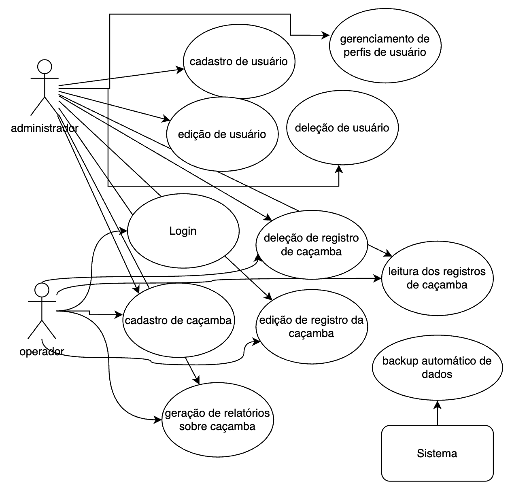

# Especificação do projeto

Pré-requisitos: <a href="01-Contexto.md"> Documentação de contexto</a>

## Personas

Carlos Henrique tem 38 anos, é administrador de uma empresa de construção civil e trabalha com gestão de recursos e logística. Ele é casado, tem dois filhos e está sempre buscando otimizar os processos internos de sua empresa. Carlos utiliza frequentemente sistemas para gerenciar as ferramentas e equipamentos utilizados nas obras e está interessado em uma plataforma que facilite o acompanhamento das caçambas, especialmente no que diz respeito ao seu status e localização. Seu objetivo é melhorar a organização e garantir que os recursos sejam bem utilizados e os custos controlados.

## Histórias de usuários

Com base na análise das personas, foram identificadas as seguintes histórias de usuários:

| EU COMO...           | QUERO/PRECISO...                                           | PARA...                                                |
|----------------------|------------------------------------------------------------|--------------------------------------------------------|
| Usuário autenticado   | Registrar uma nova caçamba no sistema                      | Manter o controle das caçambas disponíveis e seu status |
| Usuário autenticado   | Editar os dados de uma caçamba registrada                  | Atualizar detalhes como localização, capacidade e status|
| Administrador         | Excluir caçambas que não estão em uso                      | Garantir que apenas caçambas ativas e em uso permaneçam no sistema |
| Usuário autenticado   | Visualizar uma lista de todas as caçambas cadastradas      | Consultar informações como ID, localização, capacidade e status das caçambas |
| Usuário autenticado   | Buscar caçambas no sistema usando filtros como localização e status | Encontrar rapidamente as caçambas que atendem aos meus critérios |
| Administrador         | Receber notificações por e-mail sobre mudanças no status das caçambas | Ser informado rapidamente sobre alterações importantes no status das caçambas |
| Administrador         | Gerar relatórios sobre o uso das caçambas                   | Analisar os dados de uso e tomar decisões informadas    |
| Usuário autenticado   | Visualizar a localização das caçambas em um mapa interativo | Verificar facilmente a posição geográfica das caçambas cadastradas |
| Administrador         | Acessar o histórico de modificações de caçambas             | Saber quem fez alterações nas caçambas e quais campos foram modificados |

## Requisitos

As tabelas a seguir apresentam os requisitos funcionais e não funcionais que detalham o escopo do projeto. Para determinar a prioridade dos requisitos, aplique uma técnica de priorização e detalhe como essa técnica foi aplicada.

### Requisitos funcionais

| ID     | Descrição do Requisito                                               | Prioridade |
|--------|---------------------------------------------------------------------|------------|
| RF-001 | Permite o registro de uma nova caçamba no sistema com dados como localização, capacidade, data de instalação e status. | ALTA       |
| RF-002 | Permite que um usuário altere os dados de uma caçamba registrada, como localização, capacidade e status. | ALTA       |
| RF-003 | Exibe uma lista de caçambas cadastradas no sistema, com informações como ID, localização, capacidade e status. | ALTA       |
| RF-004 | Permite que o usuário pesquise por caçambas usando filtros como localização, capacidade e status. | ALTA       |
| RF-005 | Permite a exclusão de caçambas registradas, caso não estejam em uso, removendo permanentemente o registro. | ALTA       |
| RF-006 | Mantém o registro de todas as alterações feitas nas caçambas, incluindo dados como usuário responsável, data da alteração e campo alterado. | MÉDIA      |
| RF-007 | Envia notificações por e-mail quando há mudanças no status de caçambas, como de "disponível" para "em uso" ou "em manutenção". | ALTA       |
| RF-008 | Gera relatórios baseados no uso das caçambas, permitindo a exportação dos dados em formatos como PDF ou CSV. | BAIXA      |
| RF-009 | Exibe a localização das caçambas em um mapa interativo, permitindo que o usuário visualize a posição geográfica das caçambas cadastradas. | BAIXA      |

### Requisitos não funcionais

| ID     | Descrição do Requisito                                               | Prioridade |
|--------|---------------------------------------------------------------------|------------|
| RNF-001 | O sistema deverá ser publicado e utilizado em browsers, plataforma web. | ALTA       |
| RNF-002 | Usuários “Operadores” deverão utilizar o sistema após a execução de um treinamento. | MÉDIA      |
| RNF-003 | Os dados devem ser protegidos, com backups automáticos periódicos para garantir a integridade e disponibilidade da informação. | BAIXA      |

## Restrições

O projeto está restrito aos itens apresentados na tabela a seguir.

|ID| Restrição                                             |
|--|-------------------------------------------------------|
|001| O projeto deverá ser entregue até o final do semestre |
|002| O custo total do projeto não deve exceder o orçamento definido       |

## Diagrama de casos de uso

